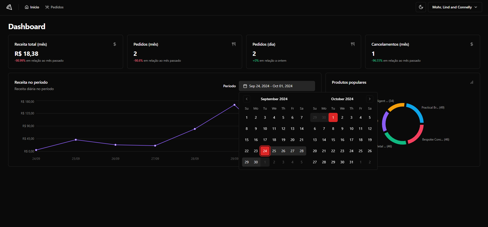
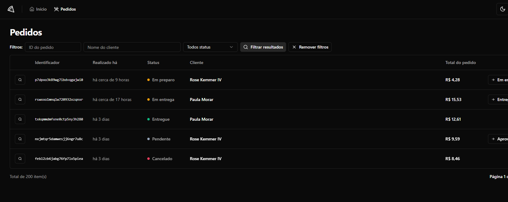

# Dashboard App

Este projeto é um **Dashboard para restaurantes** desenvolvido em **React** com **react-query**. A aplicação oferece uma interface intuitiva para gerenciar pedidos, permitindo aos usuários visualizar, enviar e cancelar pedidos facilmente. Os dados são apresentados em gráficos informativos que ajudam a monitorar as finanças e o desempenho dos pedidos.

Os testes unitários foram realizados com **Vitest** e testes E2E com **Playwright**, garantindo a robustez da aplicação, com tipagem completa em **TypeScript**. A estilização é feita com **TailwindCSS**, utilizando componentes do **ShadcnUI**. A API é construída em **BunJS**, e o login dos usuários é simplificado através de um sistema de **magic link**.

Além disso, a interface conta com um calendário que permite visualizar as datas dos pedidos e o gráfico se ajusta conforme a data informada, proporcionando uma gestão ainda mais eficiente e organizada, ainda contando com interface otimista em alguns pontos da aplicação para melhor experiência do usuário.

## Demonstração

  
Página Home

 
Página de pedidos

## Tecnologias Utilizadas

- **React**: Biblioteca JavaScript.
- **TypeScript**: Para tipagem estática.
- **Vite**: Ferramenta de build rápida para desenvolvimento front-end.
- **React Query**: Biblioteca para gerenciamento de estado remoto e caching de dados.
- **Playwright**: Ferramenta para testes de ponta a ponta.
- **ShadcnUI**: Conjunto de componentes UI acessíveis e personalizáveis.

## Instalação

Para executar este projeto localmente, siga as etapas abaixo:

1. Clone o repositório:
   ```bash
   git clone https://github.com/ryanx3/pizzashop-web.git
   cd pizzashop-web

2. Instale as dependências:
   ```bash
   npm install
   ```

3. Inicie o servidor de desenvolvimento:
   ```bash
   npm run dev
   ```

4. Acesse o aplicativo em [http://localhost:3000](http://localhost:3000).

## Scripts

Os seguintes scripts estão disponíveis:

- **`dev`**: Inicia o servidor de desenvolvimento.
- **`dev:test`**: Executa os testes unitários com Vitest.

## Testes

O aplicativo utiliza **Vitest** para testes unitários e **Playwright** para testes de ponta a ponta. Para executar os testes, use os seguintes comandos:

### Testes Unitários

```bash
npm run test
```

### Testes E2E

Para executar testes E2E com Playwright, você pode usar:

```bash
npx playwright test
```

## Contribuição

Sinta-se à vontade para contribuir! Faça um fork do projeto, crie uma branch para suas alterações e envie um pull request.

## Licença

Este projeto está licenciado sob a MIT License. Veja o arquivo `LICENSE` para mais detalhes.
